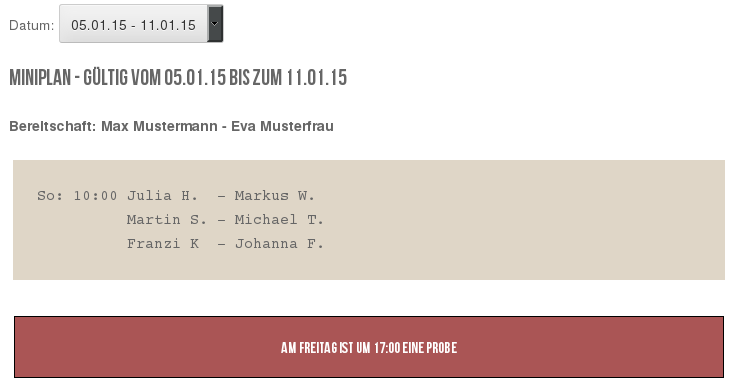

WP-MiniPlan
===========

Displays a "Miniplan" on Wordpress sites and let privileged people edit it. Use the [miniplan id='x'] tag.

See also [readme.txt](readme.txt).

Unfortunately only German language is supported until now.

And this project is unfortunately in a very bad state and needs much rework... In the frontend everything seem to work, but the code is very very bad!
If you want to use this however, please contact me and we can see, if it is worth for a rework...

USAGE
-----

Clone this git in `<$WordPress-directory>/wp-content/plugins/` and activate it in Wordpress admin panel.

SCREENSHOTS
-----------

### public view

### admin panel

### admin panel - add new

The screenshots are taken with an adapted [striker theme](https://wordpress.org/themes/striker).

LICENSE
-------

 
<a href="https://github.com/sedrubal/wp-miniplan">WP-Miniplan</a>
by
<a xmlns:cc="http://creativecommons.org/ns#" href="https://github.com/sedrubal" property="cc:attributionName" rel="cc:attributionURL">sedrubal</a>
is licensed under a
<a rel="license" href="http://creativecommons.org/licenses/by/4.0/">Creative Commons Attribution 4.0 International License</a>.
